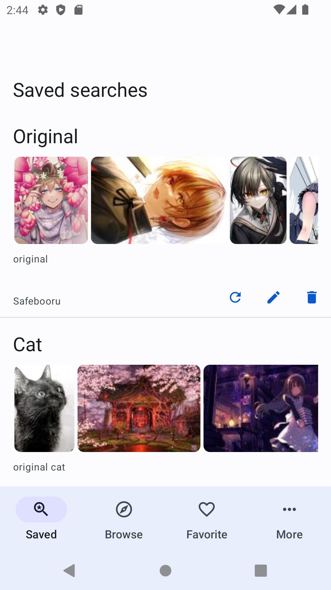
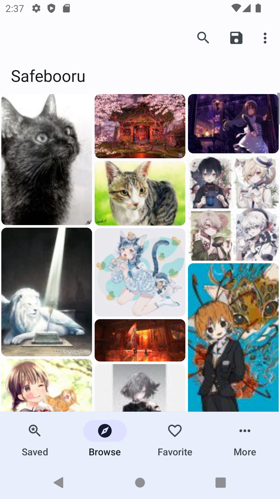
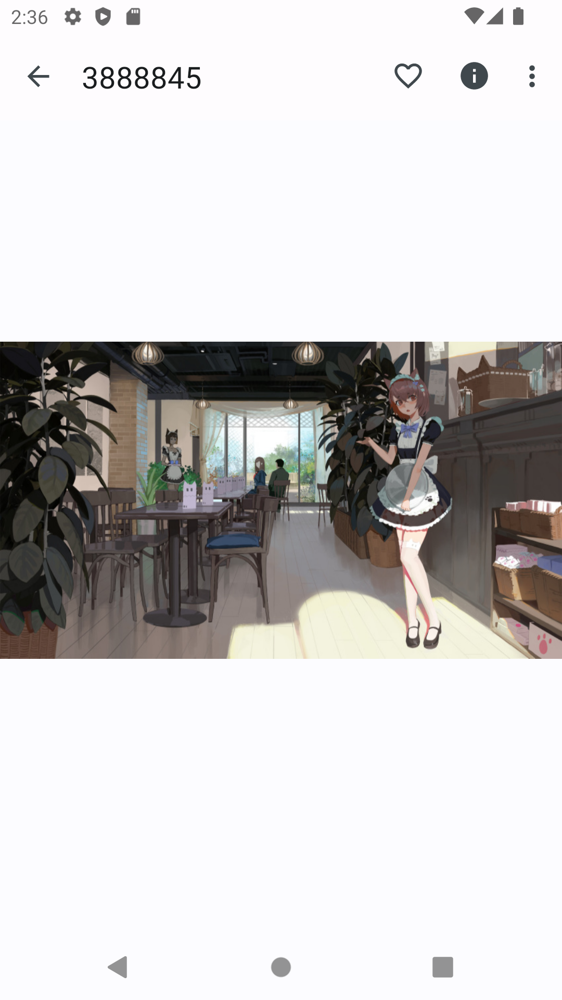

### ⚠️ IMPORTANT ⚠️ — @hyphenrf (Hi o/)

This project did **NOT** start as original work of mine. It is forked from a now deleted
[repository](https://github.com/faldez/shachi).

As far as I'm aware, the author disappeared from the face of the internet. The email attached to the
commits is at `faldez.dev`, a domain which isn't even parked. I couldn't get the author approval (or
insights) for this fork. This is also the only fork I'm aware of.

More details at the end.

# Shachi

Booru viewer for Android with support for Gellbooru, Danbooru and Moebooru

## Screenshots

|  |  |  |
| --------------------------------------- | ------------------------------------------ | -------------------------------------- |
|                                         |                                            |                                        |

## Features
- Browse image and video posts from booru servers
- Read comments for the post
- Favorite post
- Backup and restore
- Saved searches to see newest posts you care about
- Hide or mute rated posts
- Download post
- and more!

Supported booru engines:
- Danbooru
- Moebooru
- Gelbooru

----

### More details (Hi again o/)

This is just an app that I found fits well with my needs, and didn't want it to rot and disappear.

I'm not an Android developer (but kinda am now? technically??). That is to say, I'm not yet familiar
with Android conventions and mobile app development in general. I studied the early commits briefly,
and saw the work of someone who seems experienced or at least comfortable in these waters. In short,
I'll probably do the code some injustice at first.

Fixes will be slow and breakages guaranteed as I learn more of the code inherited. Hopefully at some
point I'll be comfortable enough with this code to shed some debt for the developer (that's me), and
give the user (that's also me :D) a more reliable experience.

I'm not exercising all code paths so the bugs situation will mostly improve for just one path: mine.
I follow a couple of obscure memes and wallpapers booru sites. Definitely not the best for testing.

Anyway, Bug reports are welcome (with absolutely zero promises attached to this statement). I've got
bugs reported to me in private and I documented those in the issue tracker as well.

I'm writing that notice above as a proper attribution, because the author didn't leave a name in the
copyright text, and I didn't get the chance to know them personally.  
As proper as I could manage anyway.
